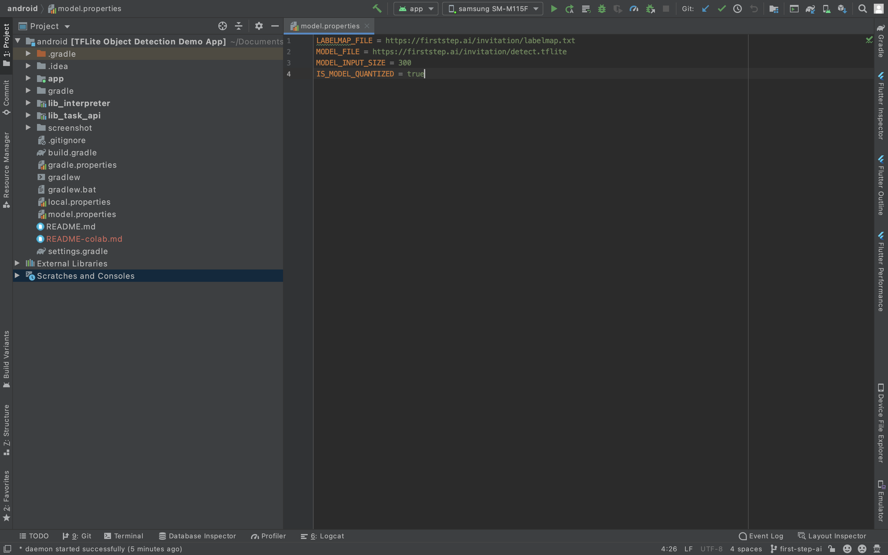

# TensorFlow Lite Object Detection Android Demo with colab integration

## Getting started
You need to create *model.properties at root directory of the project and configure the following as shown in image.

1. **Label URL**: The Url of labelfile to download. eg:-

        LABELMAP_FILE = https://firststep.ai/invitation/labelmap.txt

2. **Model File**: The Url of tflite Model file. eg:-

        MODEL_FILE = https://firststep.ai/invitation/detect.tflite

3. **Model Input Size**: The model input size , eg:-

		MODEL_INPUT_SIZE = 300

3. **Model quantized**: Is the model provided quantized or not, eg:-

		IS_MODEL_QUANTIZED = true

